# 百家号设计框架文档

## 概述

通过对百家号框架参考图中16个页面素材的重新分析，框架定义从“具体内容模块组合”调整为“页面区域关系模式”。本次不改变文档结构，只重新梳理框架颗粒度、合并收敛框架类型，并重写每一个框架结构的详解内容。

核心判断：框架应定义**稳定关系**，不定义**具体内容**。例如“指标卡片、课程卡片、评论列表、商品榜单、收益卡、设置项”等都属于功能或组件，不应作为框架颗粒度；框架只描述区域之间的组织关系、主次关系、滚动关系、可选关系。

基于16张参考图，原8类框架收敛为 **5种框架类型**。所有页面仍共享统一的全局基础结构：顶部导航栏（Header Bar）+ 左侧导航栏（Left Sidebar Nav）。其中首页和个人中心虽然业务内容不同，但右侧内容区均为左右两列、纵向堆叠的信息组织关系，应统一归入同一个框架。

---

## 全局基础模块

| 模块名称 | 说明 |
|---------|------|
| **顶部导航栏 (Header Bar)** | 全局品牌、热点提示、通知、账号入口等持续性系统区域；不参与具体页面框架分类。 |
| **左侧导航栏 (Left Sidebar)** | 全局功能树与当前菜单定位；作为页面外壳存在，不作为业务框架的差异点。 |

---

## 框架类型总览

| 编号 | 框架名称 | 布局特征 | 适用场景数 |
|------|---------|---------|-----------|
| F1 | 双列聚合框架 | 左主内容列 + 右辅助内容列，双列均可纵向堆叠 | 2 |
| F2 | 单工作区框架 | 单一主内容容器，内部可承载筛选、数据、列表或空状态 | 7 |
| F3 | 主从处理框架 | 左侧对象集合 + 右侧对象处理区 | 1 |
| F4 | 发现浏览框架 | 主资源浏览区 + 右侧上下文辅助栏 | 4 |
| F5 | 叙事转化框架 | 纵向叙事流：引导区 + 说明区 + 转化区 | 2 |

> 合并说明：原“综合仪表盘框架”和“设置中心框架”虽然内容不同，但首页与个人中心都呈现右侧内容区双列结构，因此合并为 F1 双列聚合框架。原“数据分析框架、列表管理框架、成长等级框架”中大量差异来自内容和组件，而非结构关系，本次继续按区域关系合并到更稳定的结构模式中。

---

## 框架详细定义

### F1 - 双列聚合框架 (Two-column Aggregated Framework)

**布局结构：** 左主内容列 + 右辅助内容列；两列都允许纵向堆叠多个信息区，左列承载主要任务或配置内容，右列承载状态、资产、权益、推荐、辅助行动等补充内容。

**结构关系：**
| 区域 | 关系定义 | 规则 |
|------|---------|------|
| 左主内容列 (Primary Column) | 页面核心内容列，承载主要任务入口、状态概览、配置表单或对象分组 | 宽度更大，是页面主要操作与阅读区域 |
| 右辅助内容列 (Auxiliary Column) | 页面辅助内容列，承载状态提示、资产信息、权益信息、推荐内容或快捷行动 | 宽度较小，纵向堆叠，服务左侧主内容 |
| 纵向分组区 (Stacked Sections) | 两列内部都可以按主题纵向分组 | 分组可以承载不同功能内容，但不改变双列关系 |

**参考图观察：**
- 首页和个人中心都不是单一满宽工作区，而是在去掉通用顶导航和侧边栏后，右侧内容区呈现稳定的左右两列结构。
- 首页左列承载创作入口、数据概览、评论/私信、任务/话题/热点等聚合内容，右列承载打卡、涨收入、快捷导航、学习创作等辅助内容。
- 个人中心左列承载账号信息、账号管理、认证、内容设置、收益设置等主配置内容，右列承载安全中心、资产、权益、账号状态优化等辅助内容。
- 两者差异是业务内容差异，不是框架关系差异，因此应统一为同一框架。

**适用规则：**
- 适合“左侧主内容连续组织 + 右侧辅助信息纵向补充”的页面。
- 不应把“打卡、收入、设置项、资产卡、权益卡”等写成框架模块，它们只是左右两列中的功能内容。

---

### F2 - 单工作区框架 (Single Workspace Framework)

**布局结构：** 顶部局部导航/筛选 + 单一主工作区；主工作区可以承载数据探索、对象管理、空状态、设置配置或成长信息。

**结构关系：**
| 区域 | 关系定义 | 规则 |
|------|---------|------|
| 局部控制区 (Local Controls) | 当前页面内的分类、筛选、时间、搜索、状态切换等控制关系 | 位于工作区上方，服务主工作区 |
| 主工作区 (Workspace) | 承载当前页面的核心对象、数据或任务 | 单一主导区域，不拆成并列主栏 |
| 反馈/空状态区 (Feedback State) | 当对象为空或数据不足时，替代主内容表达状态和下一步 | 属于工作区状态，不单独形成框架 |

**参考图观察：**
- 内容分析、号主页分析、收入中心等数据页虽然内部有图表、指标、表格，但本质都是单一数据探索工作区。
- 作品管理、素材管理、话题管理虽然呈现列表或空状态，但本质都是单一对象管理工作区。
- 成长权益虽然有等级、权益、矩阵等视觉内容，但区域关系仍是一个主工作区内完成成长路径理解。

**适用规则：**
- 适合“用户进入一个页面，只围绕一个主对象集合或一个主任务连续操作”的页面。
- 不应因组件不同拆成多个框架：图表、列表、空状态、设置项、成长坐标都属于实现层或内容层。
- 局部控制区可有可无；有控制区时，它只服务主工作区，不改变框架类型。

---

### F3 - 主从处理框架 (Master Detail Framework)

**布局结构：** 左侧对象集合 + 右侧对象详情/处理区；左侧选择驱动右侧内容变化。

**结构关系：**
| 区域 | 关系定义 | 规则 |
|------|---------|------|
| 对象集合区 (Master) | 承载可选择对象集合 | 宽度稳定，负责定位对象 |
| 对象处理区 (Detail) | 承载当前对象的详情、动作和后续反馈 | 面积更大，是处理任务的主区域 |
| 顶部控制区 (Controls) | 对对象集合进行分类、筛选或状态切换 | 作用于 master/detail 关系，不独立成框架 |

**参考图观察：**
- 评论管理是16张参考图中最明确的主从关系：左侧评论集合，右侧当前评论处理。
- 页面核心不是列表，也不是回复框，而是“选择对象 → 处理对象”的关系。

**适用规则：**
- 适合需要在同页高频切换对象并立即处理的场景。
- 不应把“评论列表、回复输入框、点赞按钮”等作为框架定义，它们只是 master/detail 区域内的功能实现。

---

### F4 - 发现浏览框架 (Discovery Browse Framework)

**布局结构：** 主资源浏览区 + 右侧上下文辅助栏；主区域用于浏览/发现资源，右侧用于状态、任务、学习、榜单或管理提示。

**结构关系：**
| 区域 | 关系定义 | 规则 |
|------|---------|------|
| 资源浏览区 (Discovery Workspace) | 承载可浏览、可选择、可参与的资源集合 | 是页面主区域，通常支持分类切换 |
| 上下文辅助栏 (Context Rail) | 承载与当前浏览任务相关的辅助信息 | 固定在右侧，可包含任务、记录、排行、推荐等 |
| 局部导航区 (Local Navigation) | 用于切换资源类别或业务子域 | 可横向置顶，不改变主从关系 |

**参考图观察：**
- 学习中心、度星选商单、电商带货均是“资源发现 + 右侧辅助”的关系。
- 搜索话题虽然局部为空状态，但仍是围绕可参与资源进行发现和筛选。
- 收入中心在结构上更接近单工作区，但度星选商单/电商带货等资源场景明显需要保留右侧上下文辅助栏关系。

**适用规则：**
- 适合用户浏览资源、选择资源、参与任务或查看推荐的场景。
- 不应把“课程卡片、商品榜单、任务卡、内容榜单、搜索热词”等写成框架，它们只是资源浏览区或上下文辅助栏中的内容。

---

### F5 - 叙事转化框架 (Narrative Conversion Framework)

**布局结构：** 纵向叙事流；由顶部价值引导、中部说明论证、底部行动转化构成。

**结构关系：**
| 区域 | 关系定义 | 规则 |
|------|---------|------|
| 引导区 (Hero) | 建立页面主题、价值主张和用户预期 | 首屏优先，视觉权重最高 |
| 说明区 (Narrative Sections) | 分段解释机制、权益、亮点或案例 | 按阅读顺序纵向展开 |
| 转化区 (Conversion Area) | 收束路径，引导开通、申请、同意或下一步 | 位于叙事流末端或关键节点 |

**参考图观察：**
- 内容分销、百享计划都不是工作台或管理页，而是产品机制说明与开通转化页面。
- 页面差异在具体业务内容，不在框架关系；二者都遵循线性叙事和最终转化。

**适用规则：**
- 适合产品介绍、权益说明、活动开通、计划申请等线性说服页面。
- 不应把“产品亮点、精选案例、协议勾选、立即开通按钮”等作为框架模块，它们属于叙事内容或转化实现。

---

## 场景-框架对应关系

为了让“框架结构 → 对应场景 → 页面图”更直观，以下按框架分组展示。每组先说明稳定结构关系，再用结构图小图和页面参考图并列展示归属场景。

### F1 - 双列聚合框架

**结构关系：** 左主内容列 + 右辅助内容列；两列均可纵向堆叠分组。

| 场景 | 结构图 | 页面图 | 关系说明 |
|------|--------|--------|---------|
| 创作者聚合工作台 | 左主内容列 + 右辅助内容列，两列纵向堆叠 | 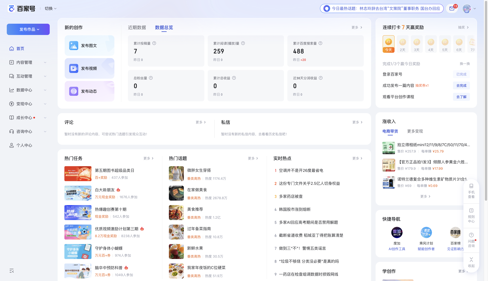 | 首页左列承担创作、数据、互动和任务聚合，右列承担打卡、收入、快捷导航等辅助行动。 |
| 账号配置聚合页 | 左主内容列 + 右辅助内容列，两列纵向堆叠 | 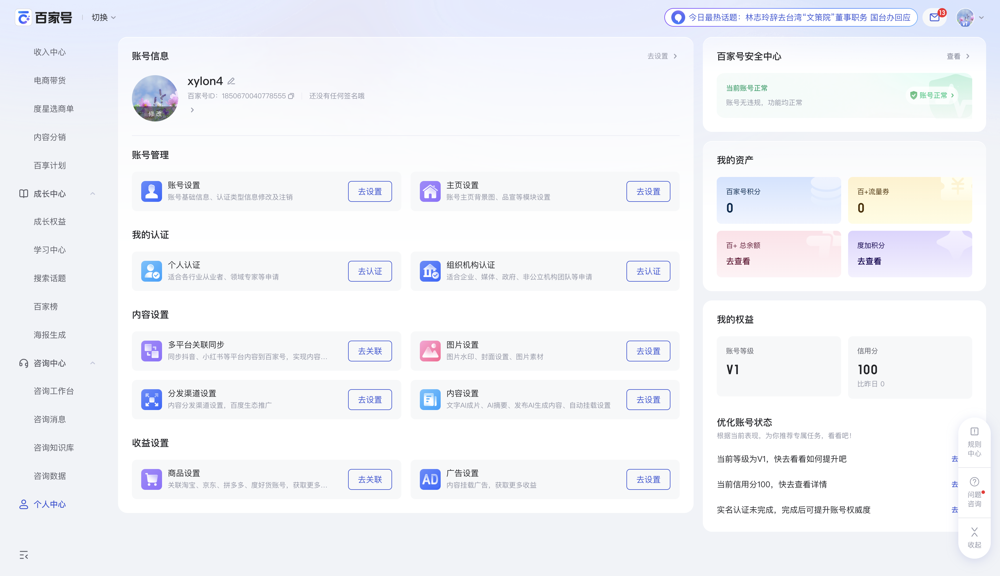 | 个人中心左列承担账号信息和配置分组，右列承担安全、资产、权益和优化建议等辅助信息。 |

---

### F2 - 单工作区框架

**结构关系：** 局部控制区 + 单一主工作区；数据、列表、设置、成长信息只是工作区内部内容。

| 场景 | 结构图 | 页面图 | 关系说明 |
|------|--------|--------|---------|
| 内容数据探索 | 局部控制区 + 单一主工作区 | 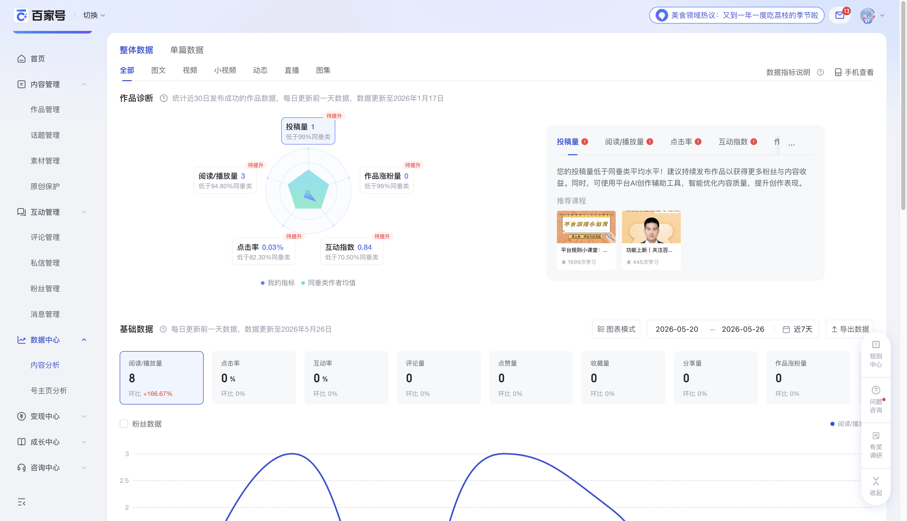 | 围绕内容数据进行单一工作区探索，图表和指标不构成独立框架。 |
| 主页数据探索 | 局部控制区 + 单一主工作区 | 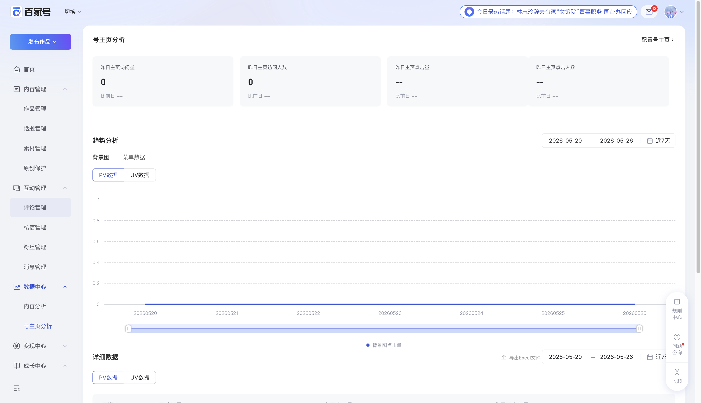 | 围绕主页访问数据进行单一工作区分析。 |
| 收益数据管理 | 局部控制区 + 单一主工作区 | 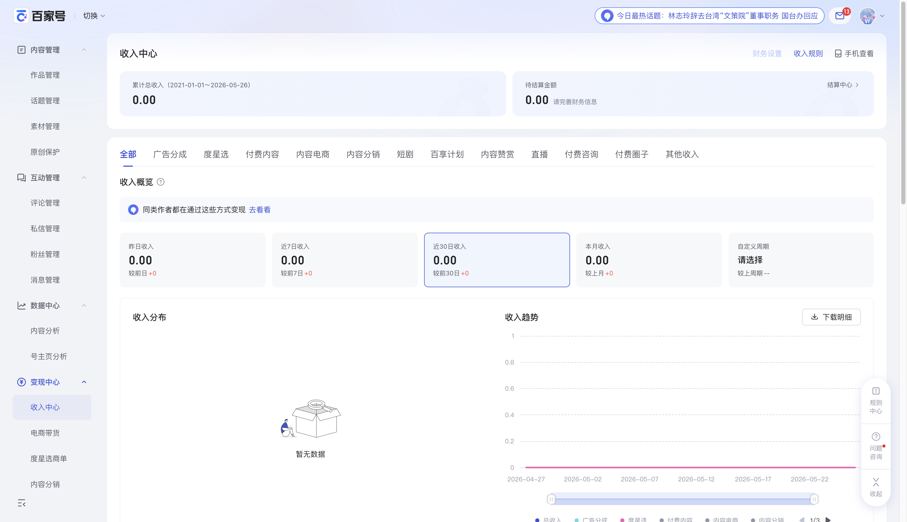 | 围绕收益概览、分布和趋势形成单一数据管理工作区。 |
| 作品对象管理 | 局部控制区 + 单一主工作区 | 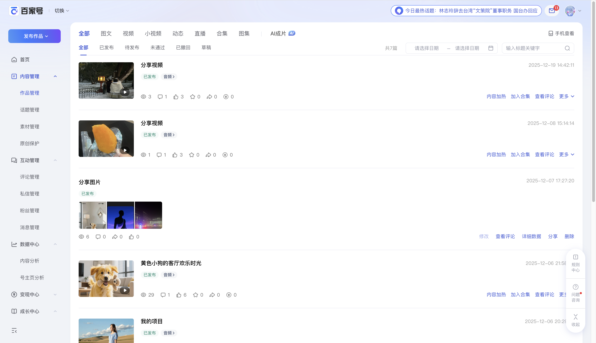 | 围绕作品对象集合进行筛选、查看和管理。 |
| 素材对象管理 | 局部控制区 + 单一主工作区 | 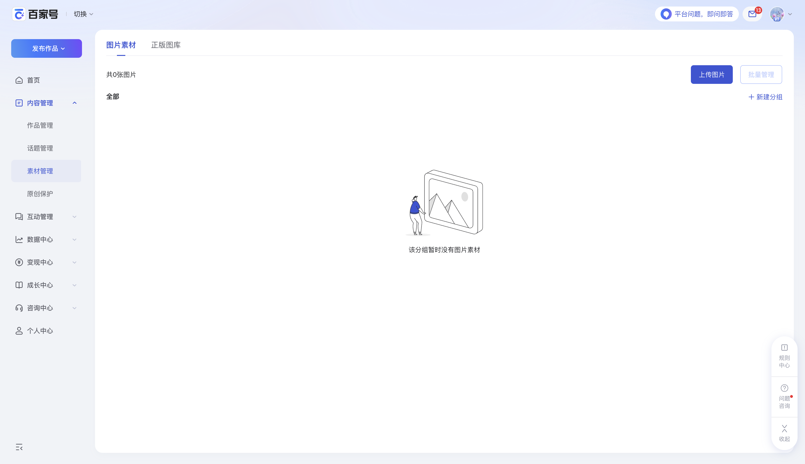 | 空状态仍属于对象管理工作区的状态表达。 |
| 话题对象管理 | 局部控制区 + 单一主工作区 | 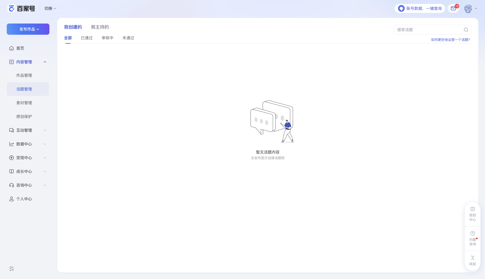 | 话题筛选、搜索和空状态共同服务同一对象管理工作区。 |
| 成长路径工作区 | 局部控制区 + 单一主工作区 | 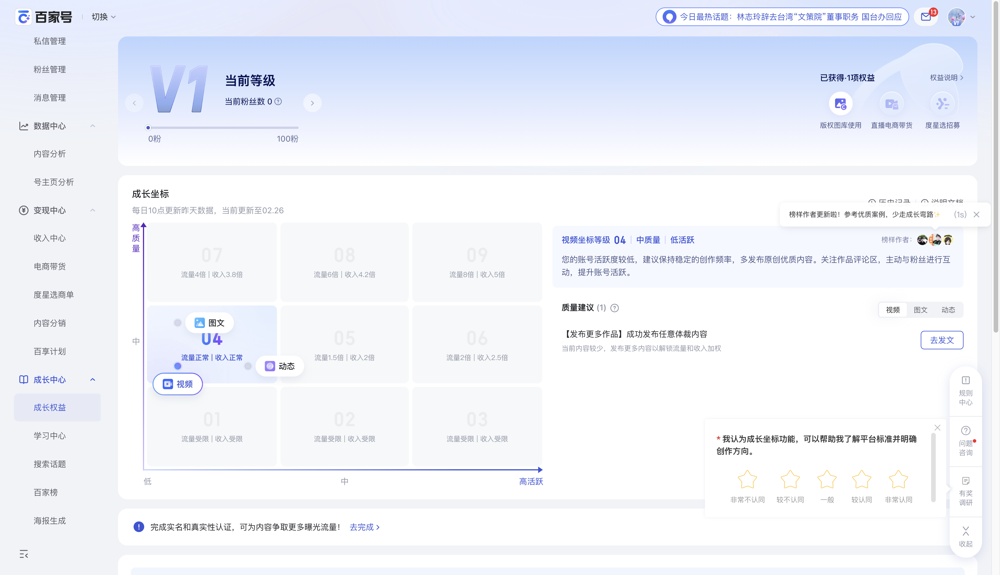 | 等级、权益、成长坐标都是同一成长任务工作区内的信息表达。 |

---

### F3 - 主从处理框架

**结构关系：** 对象集合区 + 对象处理区；左侧选择驱动右侧处理。

| 场景 | 结构图 | 页面图 | 关系说明 |
|------|--------|--------|---------|
| 互动对象处理 | 对象集合区 + 对象处理区 | 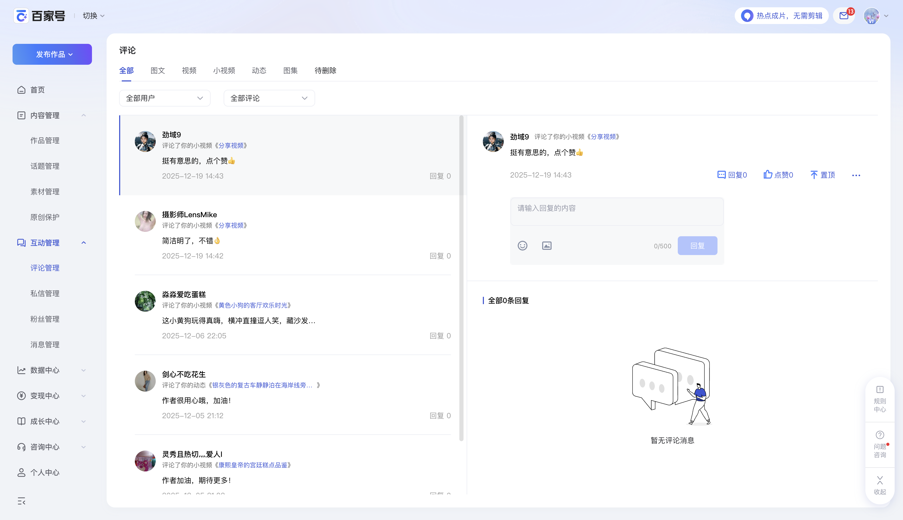 | 左侧评论集合用于定位对象，右侧详情区用于处理当前对象。 |

---

### F4 - 发现浏览框架

**结构关系：** 资源浏览区 + 上下文辅助栏；资源内容可变化，但浏览与辅助关系稳定。

| 场景 | 结构图 | 页面图 | 关系说明 |
|------|--------|--------|---------|
| 话题资源发现 | 资源浏览区 + 上下文辅助栏 | 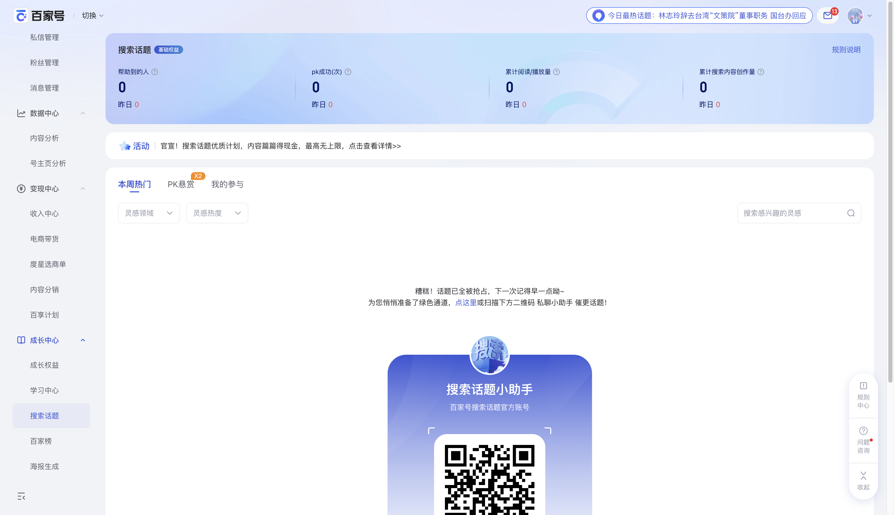 | 通过筛选和搜索发现可参与话题，空状态不改变发现浏览关系。 |
| 学习资源发现 | 资源浏览区 + 上下文辅助栏 | 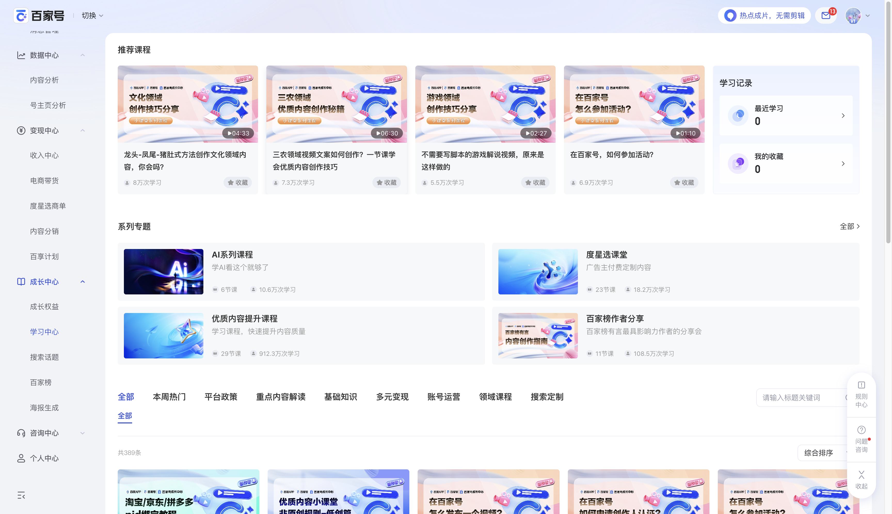 | 主区浏览学习资源，右侧承载学习记录等上下文辅助。 |
| 商单资源发现 | 资源浏览区 + 上下文辅助栏 |  | 主区发现任务资源，右侧承载商单管理、学习和榜单辅助。 |
| 商品资源发现 | 资源浏览区 + 上下文辅助栏 | 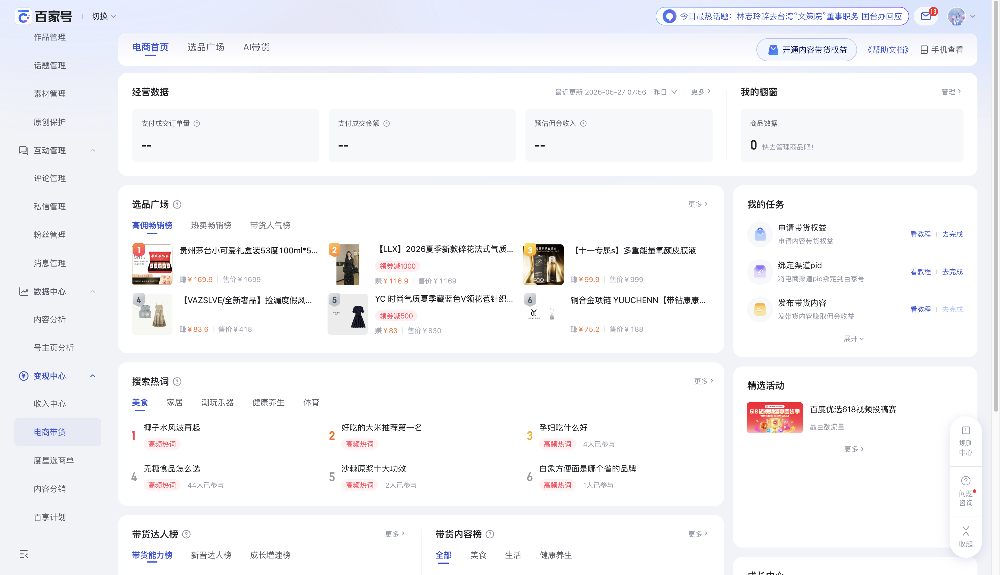 | 主区浏览商品和热词资源，右侧承载任务与活动辅助。 |

---

### F5 - 叙事转化框架

**结构关系：** 引导区 + 说明区 + 转化区；页面按阅读和说服路径纵向展开。

| 场景 | 结构图 | 页面图 | 关系说明 |
|------|--------|--------|---------|
| 分销产品转化 | 引导区 + 说明区 + 转化区 |  | 先建立价值主张，再说明模式亮点和案例，最终导向开通。 |
| 计划产品转化 | 引导区 + 说明区 + 转化区 | 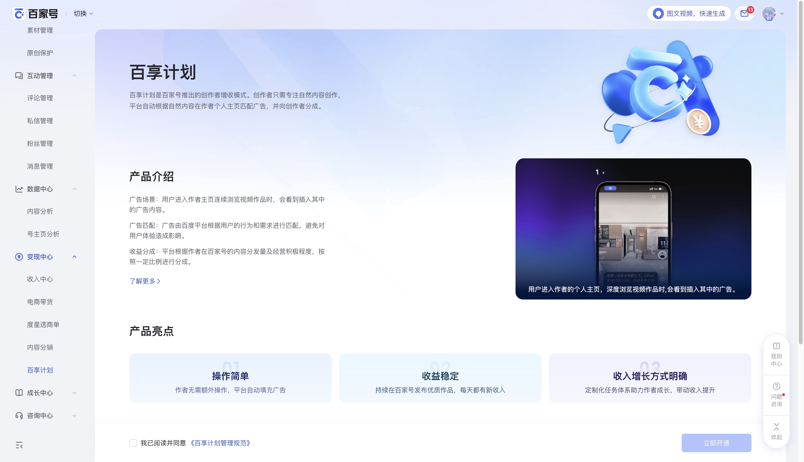 | 以产品介绍、机制说明和开通转化构成线性叙事流。 |

---

## 设计规范说明

### 通用规范
- **导航宽度：** 左侧导航约200px，作为全局外壳稳定存在。
- **内容区最大宽度：** 根据框架关系决定；单工作区可满宽，右侧栏框架需预留辅助栏宽度。
- **右侧边栏宽度：** 约300px，仅在聚合工作台和发现浏览框架中作为稳定关系出现。
- **卡片圆角：** 8-12px。
- **主色调：** #4E6EF2（蓝色系）。
- **背景色：** #F5F7FA（浅灰）。
- **卡片背景：** #FFFFFF。

### 间距规范
- **模块间距：** 20-24px。
- **卡片内边距：** 16-24px。
- **栏间距：** 20-24px。

### 框架边界规范
- 框架文档只定义区域关系、主次关系、控制关系、辅助关系。
- 功能内容只在“场景命名”和“参考图观察”中说明，不作为框架结构项。
- 组件形态不进入框架定义，例如卡片、表格、图表、列表、按钮、输入框、空状态插图等。